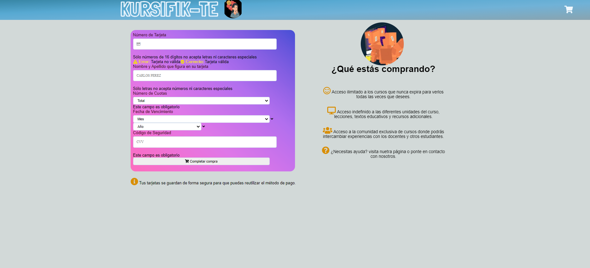

# Kursifik-Te

Este proyecto es el desarrollo de una página web de cursos, que permite validar correctamente que la tarjeta con la que el usuario realiza la compra esté activa y con medidas de seguridad al solo dejar visible en la plataforma los ultimos cuatro dígitos de esta.

## Usuarios

Este proyecto va dirigido a las personas que disfrutan de estudiar por medio de plataformas virtuales y su medio de pago es la tarjeta de crédito. Sin embargo se sienten uun poco inseguros dado que al ingresar el número de tarjeta, esta no tiene ninguna encriptación para evitar que pueda ser copiado.

## Objetivo

Con este desarrollo buscamos que las personas puedan continuar comprando sus cursos online, con la plena seguridad de que la información de sus tarjetas esta a salvo al encriptarlo y solo dejar visible los ultimos cuatro dígitos, sin inconveniente alguno en la verificación como tarjeta activa.

## Primer prototipo

## Feedback

En un principio, cuando se mostró el prototipo de alta fidelidad, sugirieron que cambiaramos los colores, ya que tenian muchos elementos distractores y quedaba muy cargado. *Estudiante del bootcamp*

## Prototipo final

